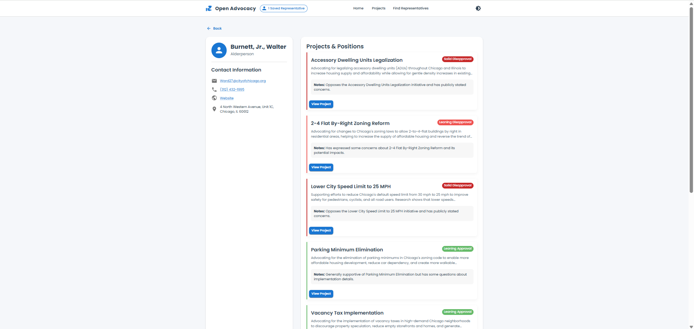

# Open Advocacy

Open Advocacy is an open-source web application connecting citizens with representatives and tracking advocacy projects. The web application allows users to look up their representatives, track advocacy projects, and understand where representatives stand on various issues.


## Current Project Features

- **Project Tracking**: View active advocacy projects with details on their status
- **Representative Lookup**: Find your representatives by entering your address
- **Status Visualization**: See color-coded representations of where representatives stand on issues
- **Geographic Integration**: Utilizes geospatial data to accurately match addresses to districts (if the geojson data has been imported into the DB)

## Tech Stack

- **Backend**: FastAPI with SQLAlchemy ORM and Pydantic models
- **Frontend**: React with TypeScript and Vite
- **Database**: Flexible database layer supporting SQLite (for development) and PostgreSQL (for production)
- **Containerization**: Docker and Docker Compose for easy deployment

## Data Model

The application uses the following core concepts:

- **Projects**: Advocacy initiatives that can be tracked and monitored
- **Entities**: Representatives or officials who have a position on projects
- **Jurisdictions**: Legislative bodies (e.g., City Council, State Senate)
- **Districts**: Geographic areas represented by entities
- **Status Records**: Track where entities stand on specific projects

## Backend Architecture

- **API Layer**: FastAPI routes that handle HTTP requests and responses
- **Service Layer**: Business logic organized by domain entities
- **Data Access Layer**: Abstract database providers with concrete implementations
- **Geo Services**: Specialized geographic functionality
- **Models**: Pydantic models for validation and ORM models for persistence

## Getting Started

### Prerequisites

- [Docker](https://www.docker.com/products/docker-desktop/) and Docker Compose for the simplest setup
- Alternatively for local development:
  - Python 3.9+ with [Poetry](https://python-poetry.org/docs/)
  - Node.js 16+ with npm

### Running the Application with Docker Compose

The easiest way to get started is using Docker Compose, which will run frontend, backend, and postgres containers:

```bash
docker-compose up
```
Once running, you can access:
- Frontend: http://localhost:3000
- Backend API: http://localhost:8000
- API Documentation: http://localhost:8000/docs

### Setting Up Example Data

To populate the database with example data, follow these steps:

1. Navigate to the backend directory:
   ```bash
   cd backend
   ```

2. Activate the Poetry shell:
   ```bash
    poetry shell
   ```

3. Create necessary database tables
  ```bash
    python -m scripts.init_db
  ```

4. Load Chicago City Council data:
  ```bash
    python -m scripts.import_data chicago
  ```

5. Import Illinois House and Senate represenative data:
  ```bash
  python -m scripts.import_data illinois
  ```


## Project Structure
```
open-advocacy/
├── backend/                # FastAPI backend service
│   ├── app/                # Application code
│   │   ├── api/            # API endpoints
│   │   ├── core/           # Core configuration
│   │   ├── db/             # Database utilities
│   │   ├── geo/            # Geospatial utilities
│   │   ├── models/         # Data models
│   │   └── services/       # Services
│   ├── data/               # Database and geospatial data
│   └── scripts/            # Setup and maintenance scripts
├── frontend/               # React+TypeScript frontend
│   ├── public/             # Static assets
│   └── src/                # Application source code
│       ├── components/     # Reusable UI components
│       ├── pages/          # Page components
│       ├── services/       # API services
│       └── types/          # TypeScript type definitions
└── docker-compose.yaml     # Docker Compose configuration
```

## Configuration

The application can be configured through environment variables. The primary configurations are:

- `DATABASE_PROVIDER`: Database backend to use (`sqlite` or `postgres`)
- `DATABASE_URL`: Connection string for the database

See `backend/app/core/config.py` for all available configuration options.

## Development Status

This project is currently in active development. The implementation plan in `PROJECT_PLAN.md` tracks completed and upcoming features.

Currently completed:
- Core backend and frontend implementation
- Project and representative lookup functionality
- Database integration with SQLite and PostgreSQL support
- Representative lookup with geographic data integration using Nominatim/OpenStreetMap

Planned additional work:
- Build authentication, group, user role, and admin system
- Improved UI and UX
- Add script to add IL Senate and House data
- Adding test coverage
- General code cleanup (lots of the frontend code is messy)
- Deployment infrastructure improvements

## Screenshots

### Project List Page


### Project Page


### Find Your Representatives Page


### Representatives Page



## Contributing

Contributions are welcome! If you're interested in contributing, please:

1. Fork the repository
2. Create a feature branch
3. Implement your changes
4. Submit a pull request

For major changes, please open an issue first to discuss what you would like to change.

## License

This project is licensed under the MIT License